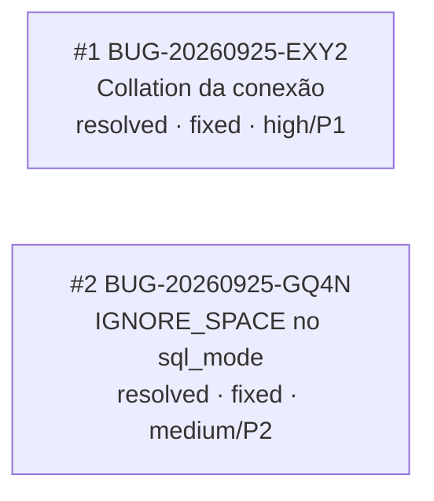

<!-- GENERATED, DO NOT EDIT: regenerado por /reversa-debugger-graph em 2026-09-25T19:57:40Z a partir de 2 bugs -->

# Grafo — migracao-de-rotinas-e-tabelas

Sem arestas com state `supported`/`confirmed` nem `proposed` — nenhuma relação foi registrada entre
os dois bugs.

## Clusters

Nenhum cluster: só 2 bugs, sem aresta entre eles, sem convergência de componente/spec detectável além
de ambos pertencerem à mesma feature agregadora (`migracao-de-rotinas-e-tabelas`) por decisão de
organização de contexto, não por relação causal comprovada.

## Impact score

Heurística de triagem (`causados*3 + bloqueados*2 + regressões*4 + relacionados*1`, só arestas
`supported`/`confirmed`) — não substitui `priority`/`severity`.

| Bug | Impact score |
|---|---|
| BUG-20260925-EXY2 | 0 (nenhuma aresta supported/confirmed) |
| BUG-20260925-GQ4N | 0 (nenhuma aresta supported/confirmed) |

Ambos já `resolved`, então o score não altera fila de triagem nesta rodada.
