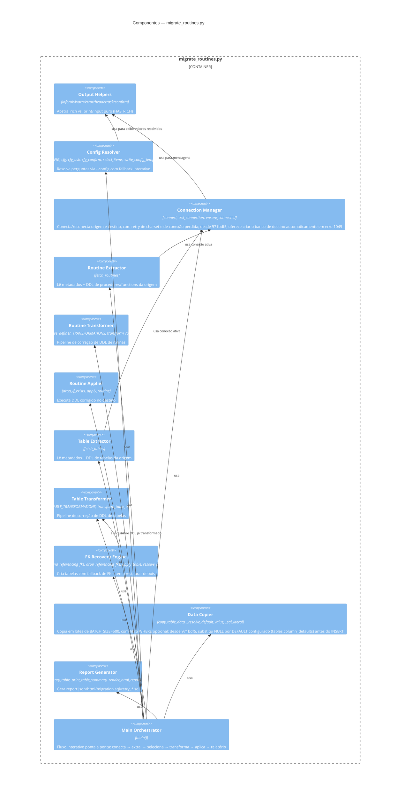
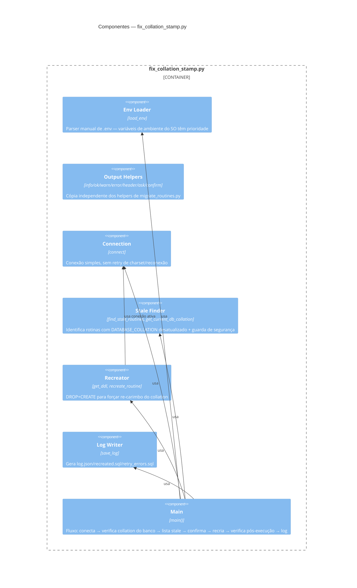

# C4 — Nível 3: Componentes

> Gerado pelo Architect em 2026-09-02 · Escala de confiança: 🟢 CONFIRMADO · 🟡 INFERIDO · 🔴 LACUNA
> Atualizado em 2026-09-15 pelo Reversa — descrições de Connection Manager e Data Copier ampliadas para refletir o commit `971bdf5`.

## Componentes de `migrate_routines.py`

## Componentes de `fix_collation_stamp.py`

Sem overlap de componentes com `migrate_routines.py` (nenhum import cruzado — ver ADR-0005).

## Notas

- O componente mais denso e com mais dependências internas em `migrate_routines.py` é o **FK Recovery Engine** — reflete a complexidade de negócio já identificada em `code-analysis.md`/ADR-0002. 🟢
- Não existem camadas de "service"/"repository"/"controller" no sentido de frameworks web — a organização é puramente funcional, por seção comentada no arquivo (ver estrutura em `CLAUDE.md`). Os "componentes" acima são um agrupamento lógico do Architect para fins de documentação, não uma estrutura de pastas/módulos real no código. 🟡
