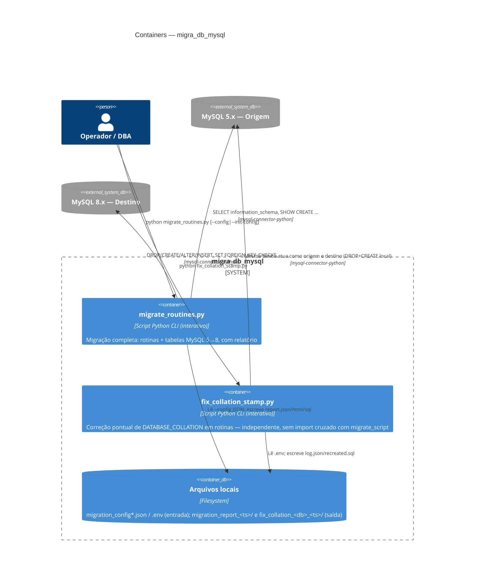

# C4 — Nível 2: Containers

> Gerado pelo Architect em 2026-09-02 · Escala de confiança: 🟢 CONFIRMADO · 🟡 INFERIDO · 🔴 LACUNA

"Container" aqui no sentido C4 (unidade de deploy/execução), não Docker — este projeto não usa containers Docker. 🟢

## Detalhamento dos containers

| Container | Tecnologia | Responsabilidade | Estado/persistência |
|---|---|---|---|
| `migrate_routines.py` | Python 3.9+, `mysql-connector-python`, `rich` (opcional) | Orquestra extração → transformação → aplicação → relatório para rotinas e tabelas | Sem estado entre execuções — cada rodada é independente; o único "estado" persistido é o relatório gerado em disco |
| `fix_collation_stamp.py` | Python 3.9+, `mysql-connector-python`, `rich` (opcional) | Recria rotinas com collation desatualizado no mesmo banco | Idem — sem estado entre execuções |
| Arquivos locais | JSON / `.env` / SQL / HTML | Entrada de configuração e saída de relatórios/logs | Cada execução gera um diretório timestampado novo — não há limpeza automática (`.gitignore` os exclui do versionamento, mas ficam acumulando no disco) 🟡 |

## Dívidas técnicas observadas neste nível

- **Duplicação entre containers:** `fix_collation_stamp.py` reimplementa `info/ok/warn/error/header/ask/confirm`, `connect()` e a regex de remoção de `DEFINER` já existentes em `migrate_routines.py` — nenhum módulo compartilhado foi extraído (ver ADR-0005). 🟢
- **Sem gerenciador de dependências formal:** nenhum `requirements.txt`/`pyproject.toml` — versões de `mysql-connector-python`/`rich` não são fixadas, risco de quebra por atualização de dependência não testada. 🟢
- **Sem testes automatizados:** 0% de cobertura (confirmado por `inventory.md`) — toda a lógica de transformação regex e recuperação de FK depende de revisão manual/execução real para validação. 🟢
- **Acúmulo de diretórios de saída:** `migration_report_<ts>/` e `fix_collation_<db>_<ts>/` não são limpos automaticamente — o `inventory.md` já lista 5 diretórios de relatório acumulados no repositório local (fora do controle de versão). 🟡
