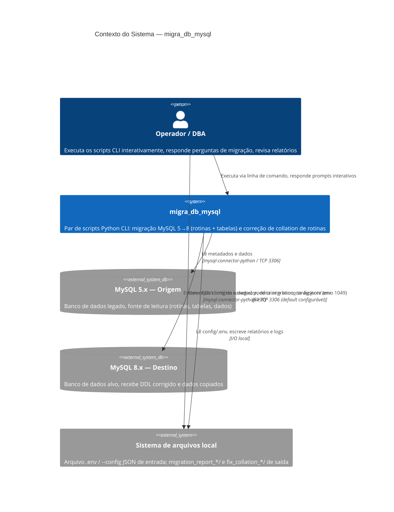

# C4 — Nível 1: Contexto

> Gerado pelo Architect em 2026-09-02 · Escala de confiança: 🟢 CONFIRMADO · 🟡 INFERIDO · 🔴 LACUNA
> Atualizado em 2026-09-15 pelo Reversa — porta padrão do destino mudou para 3306 no commit `971bdf5` (ambas as portas são apenas defaults de prompt, configuráveis).

## Notas

- Não há sistema de autenticação próprio, API externa consumida, fila de mensagens ou serviço de terceiros — a única "integração externa" real são os dois servidores MySQL (origem e destino), acessados via protocolo MySQL padrão. 🟢
- `mysql_origem` e `mysql_destino` podem ser (e frequentemente são, no fluxo de `fix_collation_stamp.py`) o **mesmo servidor físico**, em momentos diferentes do ciclo de migração — o diagrama os separa porque são conceitualmente papéis distintos (fonte vs. alvo) em `migrate_routines.py`, não necessariamente hosts distintos. 🟡
- Não há ambiente de produção/homologação formalmente modelado no código — o README recomenda "sempre teste em homologação antes de aplicar em produção", mas isso é responsabilidade do operador, não do script (não há flag `--env` ou similar). 🟢
