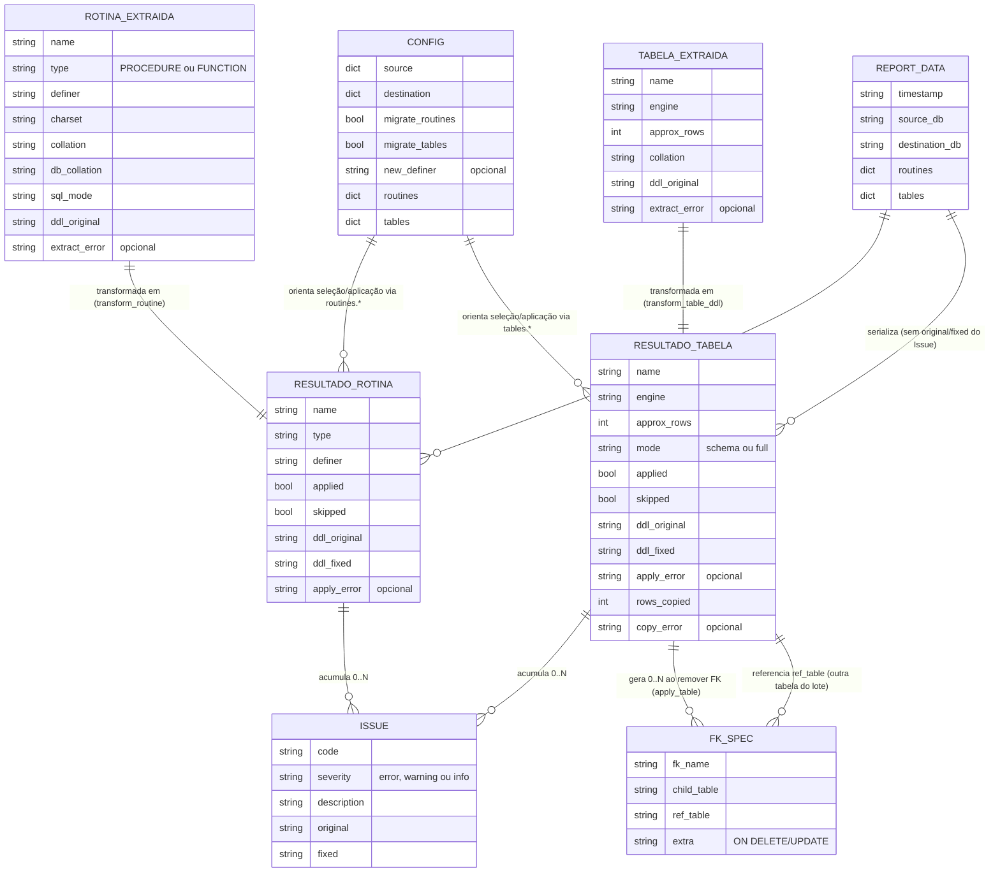

# ERD Completo — migra_db_mysql

> Gerado pelo Architect em 2026-09-02 · Escala de confiança: 🟢 CONFIRMADO · 🟡 INFERIDO · 🔴 LACUNA

## Nota importante

Este projeto **não tem um schema de banco de dados aplicacional próprio** — ele opera *sobre* schemas MySQL arbitrários fornecidos pelo operador em tempo de execução (descobertos via `information_schema`, não modelados estaticamente em código). Não há arquivos DDL, migrations ou ORM no repositório (confirmado em `inventory.md`). A análise detalhada de um schema real fica a cargo do agente independente **Data Master**, que requer acesso a um banco MySQL vivo (não disponível para este agente). 🔴

O ERD abaixo modela, em vez disso, as **estruturas de dados transientes em memória** que o próprio script usa para transportar informação entre suas etapas (extração → transformação → aplicação → relatório) — já documentadas individualmente em `data-dictionary.md`. Não são tabelas persistidas; são dicts/objetos Python que existem apenas durante uma execução.

## Cardinalidades e relações — leitura

| Relação | Cardinalidade | Observação |
|---|---|---|
| Rotina extraída → Resultado de rotina | 1:1 | Uma rotina extraída gera exatamente um resultado por execução |
| Resultado de rotina → Issue | 1:N (0 ou mais) | Cada transformação aplicada pode ou não gerar uma Issue |
| Tabela extraída → Resultado de tabela | 1:1 | Idem rotinas |
| Resultado de tabela → Issue | 1:N (0 ou mais) | Inclui issues de transformação **e** de recuperação de FK |
| Resultado de tabela → FK Spec | 1:N (0 ou mais) | Só existe se `apply_table` precisou remover FK(s) |
| FK Spec → Resultado de tabela (ref_table) | N:1 | A FK removida referencia outra tabela do mesmo lote de migração — 🟡 relação lógica, não uma FK real de banco nestas estruturas em memória |
| Config → Resultado de rotina/tabela | 1:N | Uma única config orienta todas as seleções/decisões da execução |
| Report Data → Resultado de rotina/tabela | 1:N | O relatório final agrega todos os resultados da execução |

## Lacunas 🔴

- Schema real do(s) banco(s) MySQL migrados: não documentável sem acesso a uma instância viva — delegado ao agente Data Master.
- Não há uma "entidade Migração" formal que amarre uma execução completa (com id, data, usuário) além do `timestamp` usado no nome do diretório de relatório.
