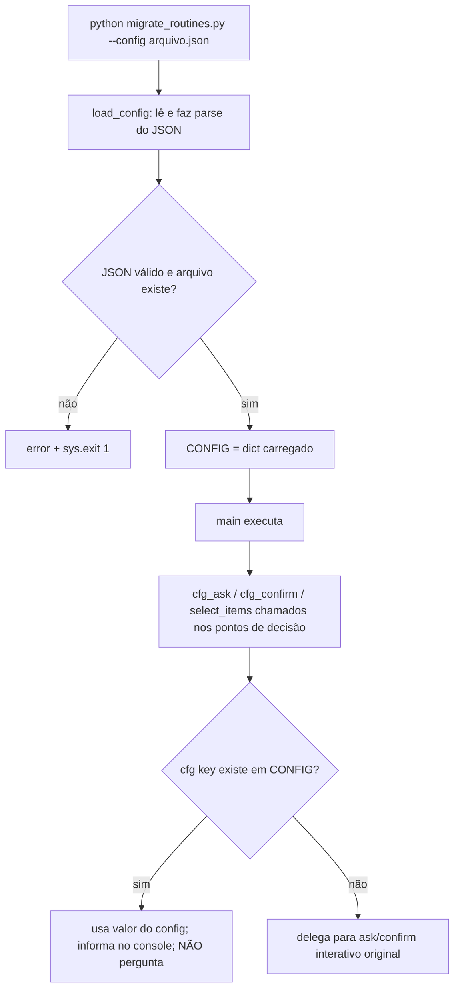
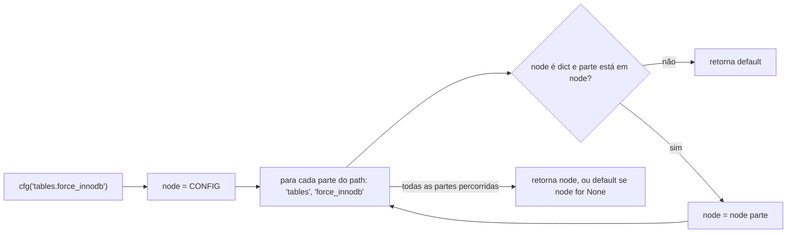
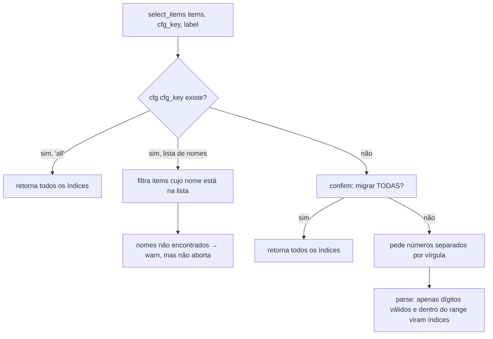
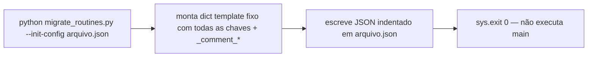

# Fluxograma — arquivo-de-configuracao

> `migrate_routines.py:55-247`
> Atualizado em 2026-09-15 pelo Reversa — reflete o commit `971bdf5`: fluxo em si inalterado; o template gerado por `--init-config` ganhou as chaves `destination.create_database_if_missing` e `tables.column_defaults` (ver `data-dictionary.md`).

## `cfg(key, default)` — resolução de caminho com pontos

## `select_items` — seleção de rotinas/tabelas

## `--init-config` (`write_config_template`)

