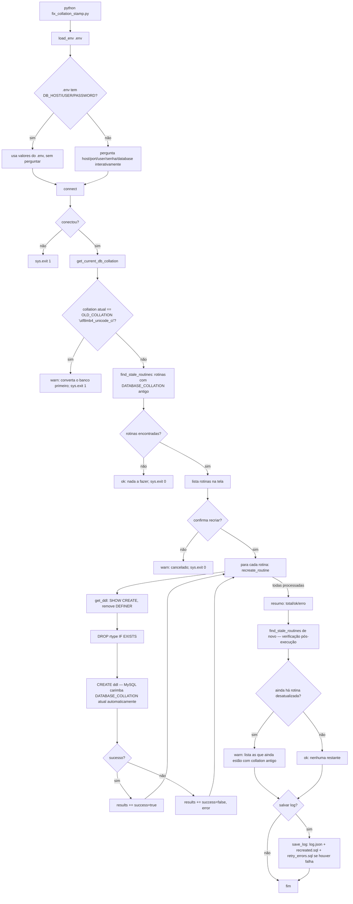

# Fluxograma — correcao-de-collation

> `fix_collation_stamp.py` (script independente, inteiro)

Nenhuma das transformações de `migrate_routines.py` (`TRANSFORMATIONS`) é aplicada aqui — o único DDL alterado é a remoção do `DEFINER`; o re-carimbo do collation é efeito colateral do `DROP`+`CREATE` no MySQL, não de uma instrução SQL direta. 🟢
