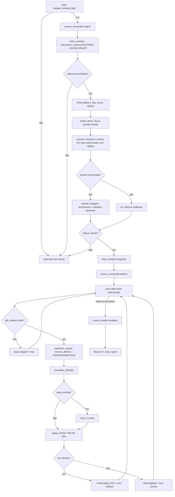

# Fluxograma — migracao-de-rotinas

> `migrate_routines.py` — extração `:345`, transformações `:434-574`, aplicação `:717-746`, orquestração `main() :1544-1685`
> Atualizado em 2026-09-15 pelo Reversa — apenas números de linha revalidados contra o commit `971bdf5` (fluxo de rotinas em si não foi alterado por esse commit).

## Transformações aplicadas em sequência (`transform_routine`)

```mermaid
flowchart LR
    DDL[DDL original] --> T0[remove_definer]
    T0 --> T1[fix_set_option — error]
    T1 --> T2[fix_old_password_hash — error]
    T2 --> T3[clean_sql_mode — error]
    T3 --> T4[fix_no_zero_date — warning]
    T4 --> T5[fix_group_concat_maxlen — warning]
    T5 --> T6[fix_sql_security — warning]
    T6 --> T7[fix_no_default_charset — warning]
    T7 --> T8[fix_only_full_group_by — warning]
    T8 --> OUT[DDL corrigido + lista de Issues]
```

Cada etapa é independente (regex pura) — nenhuma depende do resultado da anterior além de operar sobre o DDL já modificado até ali. 🟢
