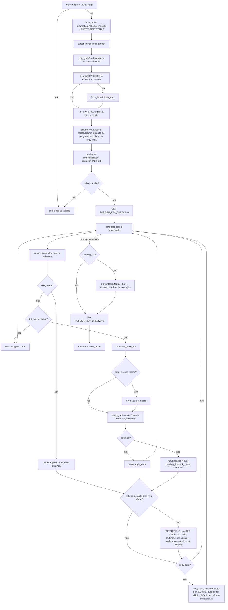
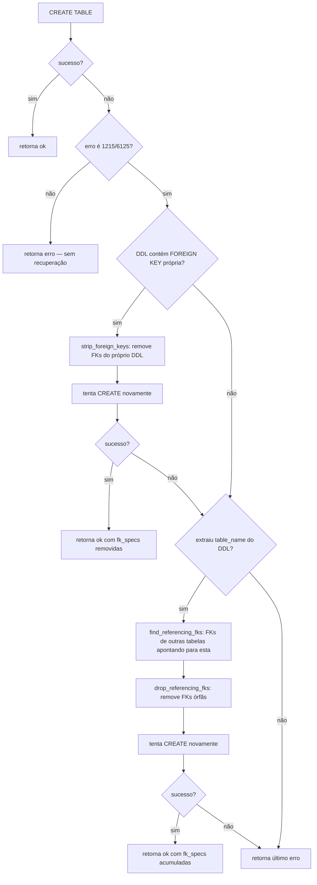
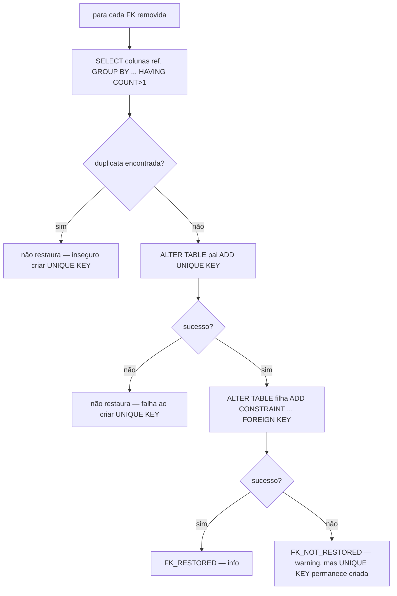

# Fluxograma — migracao-de-tabelas

> `migrate_routines.py` — extração `:388`, transformações `:575-716`, aplicação/FK/cópia `:747-1076`, orquestração `main() :1686-1995`
> Atualizado em 2026-09-15 pelo Reversa — reflete o commit `971bdf5`: passo de `column_defaults` (DEFAULT real na coluna de destino) inserido antes da cópia de dados.

## `apply_table` — recuperação de FK (dois níveis de fallback)

## `resolve_pending_foreign_keys` — restauração pós-carga

Seguro porque `FOREIGN_KEY_CHECKS=0` está ativo durante toda a migração de tabelas — dados órfãos pré-existentes não bloqueiam a criação da constraint neste ponto. 🟢
