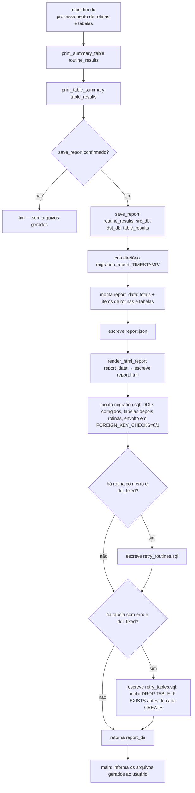
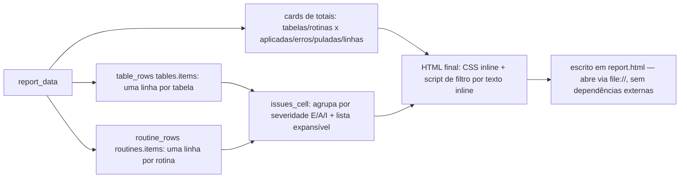

# Fluxograma — relatorios-de-migracao

> `migrate_routines.py:999-1401`

```mermaid
flowchart TD
    A[main: fim do processamento de rotinas e tabelas] --> B[print_summary_table routine_results]
    B --> C[print_table_summary table_results]
    C --> D{save_report confirmado?}
    D -->|não| Z[fim — sem arquivos gerados]
    D -->|sim| E[save_report routine_results, src_db, dst_db, table_results]

    E --> F[cria diretório migration_report_TIMESTAMP/]
    F --> G[monta report_data: totais + items de rotinas e tabelas]
    G --> H[escreve report.json]
    H --> I[render_html_report report_data → escreve report.html]
    I --> J[monta migration.sql: DDLs corrigidos, tabelas depois rotinas, envolto em FOREIGN_KEY_CHECKS=0/1]
    J --> K{há rotina com erro e ddl_fixed?}
    K -->|sim| L[escreve retry_routines.sql]
    K -->|não| M
    L --> M{há tabela com erro e ddl_fixed?}
    M -->|sim| N[escreve retry_tables.sql: inclui DROP TABLE IF EXISTS antes de cada CREATE]
    M -->|não| O[retorna report_dir]
    N --> O
    O --> P[main: informa os arquivos gerados ao usuário]
```

## `render_html_report` — montagem do HTML autocontido

```mermaid
flowchart LR
    A[report_data] --> B[cards de totais: tabelas/rotinas x aplicadas/erros/puladas/linhas]
    A --> C[table_rows tables.items: uma linha por tabela]
    A --> D[routine_rows routines.items: uma linha por rotina]
    C --> E[issues_cell: agrupa por severidade E/A/I + lista expansível]
    D --> E
    B --> F[HTML final: CSS inline + script de filtro por texto inline]
    E --> F
    F --> G[escrito em report.html — abre via file://, sem dependências externas]
```
