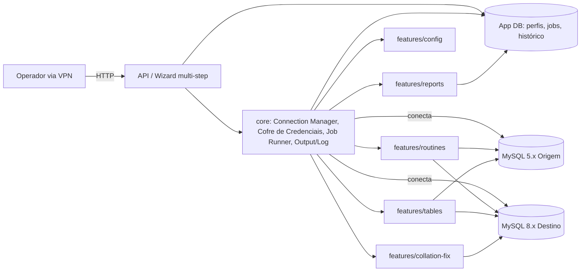

# Target Architecture

> Arquitetura alvo do sistema novo, respeitando o paradigma escolhido em `paradigm_decision.md` (híbrido/balanced) e a estratégia confirmada em `migration_strategy.md` (Strangler Fig por feature + Parallel Run).

## Visão geral

Aplicação web Node.js/TypeScript, uso interno via VPN, que expõe as 5 features de migração MySQL do legado por trás de um wizard multi-step (BR-HUMANA-001) e um job assíncrono simples em background (sem fila/broker externo — decisão híbrida de paradigma). Cada feature é uma vertical slice independente (`features/<feature>/`), compartilhando um núcleo transversal (`core/`) que substitui a infraestrutura hoje duplicada entre `migrate_routines.py` e `fix_collation_stamp.py`. A aplicação mantém seu próprio banco de estado (perfis de conexão, jobs, histórico de execuções) — algo que **não existe no legado**, que era inteiramente stateless entre execuções (ver `target_data_model.md`).

## Diagrama (Mermaid)

## Componentes

| Componente | Tipo | Responsabilidade | Origem (legado / novo / fundido) |
|---|---|---|---|
| API / Wizard | API | Coleta parâmetros em etapas, expõe endpoint de dry-run/preview, dispara job | novo (substitui prompts interativos de terminal — ver `discard_log.md` BR-DESCARTAR-001/002) |
| Core — Connection Manager | Serviço (biblioteca interna) | Conectar/reconectar origem e destino, criar banco de destino se autorizado | fundido — de `connect`/`ask_connection`/`ensure_connected` (`migrate_routines.py:248-344`) e `connect` de `fix_collation_stamp.py:144` |
| Core — Cofre de Credenciais | Serviço | Armazenar perfis de conexão cifrados em repouso (BR-HUMANA-002) | novo |
| Core — Job Runner | Worker | Executa o pipeline sequencial de uma feature em background, persiste progresso incremental (mitiga RISK-004) | novo — substitui a execução síncrona de `main()` |
| Core — Output/Log | Serviço (biblioteca interna) | Registrar eventos de execução (equivalente a `info/ok/warn/error`), agora persistidos, não só impressos | fundido — de `info/ok/warn/error/header` duplicados nos 2 scripts do legado |
| features/routines | Serviço | Extração, transformação (8 issues), aplicação de procedures/functions | migrado de `migrate_routines.py:345-574,717-746,1544-1685` |
| features/tables | Serviço | Extração, transformação, FK Recovery Engine, cópia de dados, `column_defaults` | migrado de `migrate_routines.py:388-746,747-1076,1686-1993` |
| features/config | Serviço | Validação de payload do wizard (substitui `--config`/`--init-config`) | migrado de `migrate_routines.py:55-247,1996-2081`, com mudança de superfície (ver `discard_log.md`) |
| features/reports | Serviço | Serializador único gerando `report.json`/HTML/`migration.sql`/retry (BR-MIGRAR-016) | migrado de `migrate_routines.py:1077-1498,1993-2059`, consolidado |
| features/collation-fix | Serviço | Localizar e recriar rotinas com `DATABASE_COLLATION` desatualizado, com salvaguarda de perda de rotina (RF-09) | migrado de `fix_collation_stamp.py`, agora consumindo `core/` em vez de duplicá-lo |
| App DB | DB | Persiste perfis de conexão, jobs e progresso, histórico de execuções | novo |
| MySQL Origem/Destino | DB (externo) | Bancos MySQL sendo migrados — não são gerenciados pela aplicação | preservado — é o próprio objeto de negócio da ferramenta |

## Bounded contexts

### BC-01: Migração de Estrutura (routines + tables)
- **Responsabilidade**: extrair, transformar e aplicar DDL de rotinas e tabelas, incluindo a recuperação de foreign keys.
- **Justificativa do agrupamento / separação**: `routines` e `tables` compartilham o mesmo ciclo de vida (extrair → transformar → aplicar → registrar resultado, ver `state-machines.md`) e a mesma classe `Issue` — mas são mantidos como slices separados (não fundidos num único bounded context) porque têm regras de negócio independentes (FK Recovery só existe em tables) e podem ser colocados em Parallel Run/Strangler Fig em momentos diferentes (`migration_strategy.md`).
- **Componentes internos**: `features/routines`, `features/tables`, `core/Issue`.
- **Eventos publicados**: nenhum — pipeline interno permanece sequencial (decisão híbrida de paradigma), não publica eventos de domínio.

### BC-02: Configuração e Execução (config + job runner)
- **Responsabilidade**: coletar parâmetros do operador (wizard), validar, e orquestrar a execução em background.
- **Justificativa do agrupamento / separação**: `arquivo-de-configuracao` do legado deixa de ser um contexto isolado — sua razão de existir (resolver `--config` com fallback) muda de natureza na web (ver `discard_log.md`) e passa a fazer parte do próprio fluxo de disparo do job, não um serviço à parte.
- **Componentes internos**: `features/config`, `core/JobRunner`.
- **Eventos publicados**: nenhum (decisão híbrida — sem fila real).

### BC-03: Auditoria e Relatório
- **Responsabilidade**: consolidar resultados de rotinas/tabelas em relatório (3 formatos) e manter histórico de execuções.
- **Justificativa do agrupamento / separação**: mantido como contexto isolado porque é "terminal" no fluxo (não afeta outros contextos) e tem uma decisão arquitetural própria (consolidar sob serializador único, BR-MIGRAR-016) que não se aplica aos demais.
- **Componentes internos**: `features/reports`, `App DB (histórico)`.
- **Eventos publicados**: nenhum.

### BC-04: Correção de Collation
- **Responsabilidade**: localizar e recriar rotinas com collation desatualizado, com salvaguarda contra perda de rotina.
- **Justificativa do agrupamento / separação**: mantido separado de BC-01 porque opera sobre um único banco (não origem/destino) e tem pré-condições de guarda próprias (`requirements.md` RF-02) — fundir com `routines` obscureceria essa diferença de modelo mental.
- **Componentes internos**: `features/collation-fix`.
- **Eventos publicados**: nenhum.

### BC-05: Suporte Transversal (core)
- **Responsabilidade**: Connection Manager, Cofre de Credenciais, Output/Log, Job Runner — infraestrutura consumida por todos os demais bounded contexts.
- **Justificativa do agrupamento / separação**: não é um contexto de domínio, é suporte técnico — mas precisa ser um "contexto" formal na topologia porque, no legado, ele **não existia como unidade compartilhada** (era duplicado, ADR-0005); tratá-lo como contexto de primeira classe é o que garante que a duplicação não se repita.
- **Componentes internos**: `core/*`.

## Decisões arquiteturais (ADR-style resumido)

### AD-01: Job em background simples, sem fila/broker externo
- **Decisão**: o Job Runner executa o pipeline sequencial de uma feature dentro do próprio processo da aplicação (ou um worker separado simples), persistindo progresso incrementalmente no App DB — sem Redis/Kafka/SQS.
- **Alternativas descartadas**: fila real (BullMQ/Redis) — paradigma natural pleno de Node.js.
- **Justificativa**: decisão híbrida de paradigma (`paradigm_decision.md`) — uso interno não justifica a complexidade operacional de uma fila real.
- **Rastreabilidade**: `paradigm_decision.md` § Decisão do usuário; `risk_register.md` RISK-004 (risco aceito, mitigado por persistência incremental de progresso).

### AD-02: `core/` como bounded context de suporte de primeira classe
- **Decisão**: extrair Connection Manager, Output/Log e a futura remoção de DEFINER para um módulo `core/` único, consumido por todas as 5 features.
- **Alternativas descartadas**: manter `collation-fix` com sua própria cópia dos helpers, como no legado.
- **Justificativa**: elimina a dívida técnica de duplicação já identificada em `architecture.md` (tabela de dívidas) e `discard_log.md` BR-DESCARTAR-004.
- **Rastreabilidade**: ADR-0005 do legado (`_reversa_sdd/adrs/0005-fix-collation-stamp-como-script-independente.md`); `topology_decision.md` § Mapeamento legado → novo.

### AD-03: App DB novo para estado de jobs e credenciais
- **Decisão**: introduzir um banco de aplicação (App DB) que não existe no legado, para persistir perfis de conexão (cofre), jobs e histórico — o legado era inteiramente stateless entre execuções (só gerava arquivos timestampados em disco).
- **Alternativas descartadas**: continuar sem persistência própria, gerando só arquivos em disco como o legado (inviável para um wizard multi-step com preview e cofre de credenciais).
- **Justificativa**: BR-HUMANA-001 (wizard) e BR-HUMANA-002 (cofre) exigem estado persistente que o modelo "script CLI stateless" não oferece.
- **Rastreabilidade**: `target_business_rules.md` BR-HUMANA-001/002; ver `target_data_model.md`.

## Honra ao paradigma escolhido

- **Paradigma alvo**: híbrido/balanced (procedural sequencial internamente, exposto via job assíncrono simples).
- **Como a arquitetura honra esse paradigma**:
  - Nenhum bounded context publica ou consome eventos de domínio — o Job Runner chama as funções de cada feature diretamente, em sequência, exatamente como `main()` fazia no legado (só que fora da thread da requisição HTTP).
  - Não há fila/broker externo (AD-01) — a "assincronia" é só o desacoplamento entre a requisição HTTP (que retorna imediatamente com um id de job) e a execução em si, não uma arquitetura de mensageria distribuída.
  - As funções de transformação de DDL (BR-MIGRAR-002, BR-MIGRAR-022) permanecem puras `(ddl) -> (ddl, Issue)`, portadas 1:1 sem introduzir handlers de evento — implicação 1 de `paradigm_decision.md` honrada.
  - A ordem determinística "tabelas → resolver FKs pendentes → rotinas" (implicação 2 de `paradigm_decision.md`) é mantida como um pipeline sequencial dentro do Job Runner, com o progresso rastreado explicitamente no App DB em vez de inferido do estado de um `for` em memória.

## Bordas com o legado durante a migração

Conforme a Estratégia A (Strangler Fig por feature, `migration_strategy.md`): cada bounded context (BC-01 a BC-04) é liberado na web de forma independente. Enquanto uma feature não estiver liberada, o operador continua usando o CLI legado (`migrate_routines.py`/`fix_collation_stamp.py`) diretamente — não há roteamento técnico entre as duas ferramentas (nenhum proxy/gateway), a "borda" é puramente operacional (qual ferramenta o operador escolhe usar), conforme já registrado em `cutover_plan.md`.

## Notas

O App DB (AD-03) pode ser hospedado no próprio MySQL 8.x de destino declarado no brief, como um schema de aplicação separado (`app_migracao` ou similar) — evita introduzir um novo motor de banco só para o estado interno da ferramenta, mantendo a stack mínima possível, coerente com o apetite `balanced`. Essa é uma sugestão de implementação, não uma decisão travada — o agente de codificação pode avaliar alternativas (SQLite embarcado, por exemplo) se achar mais simples para uma VM interna de baixo volume.
