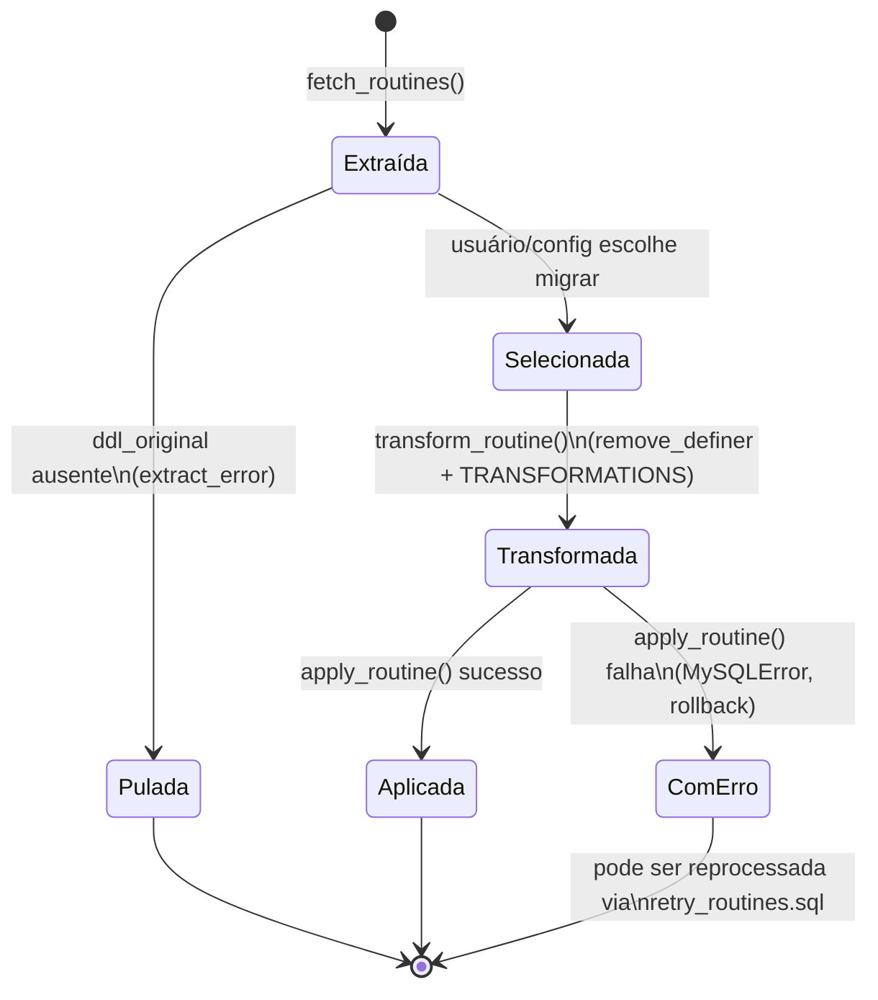
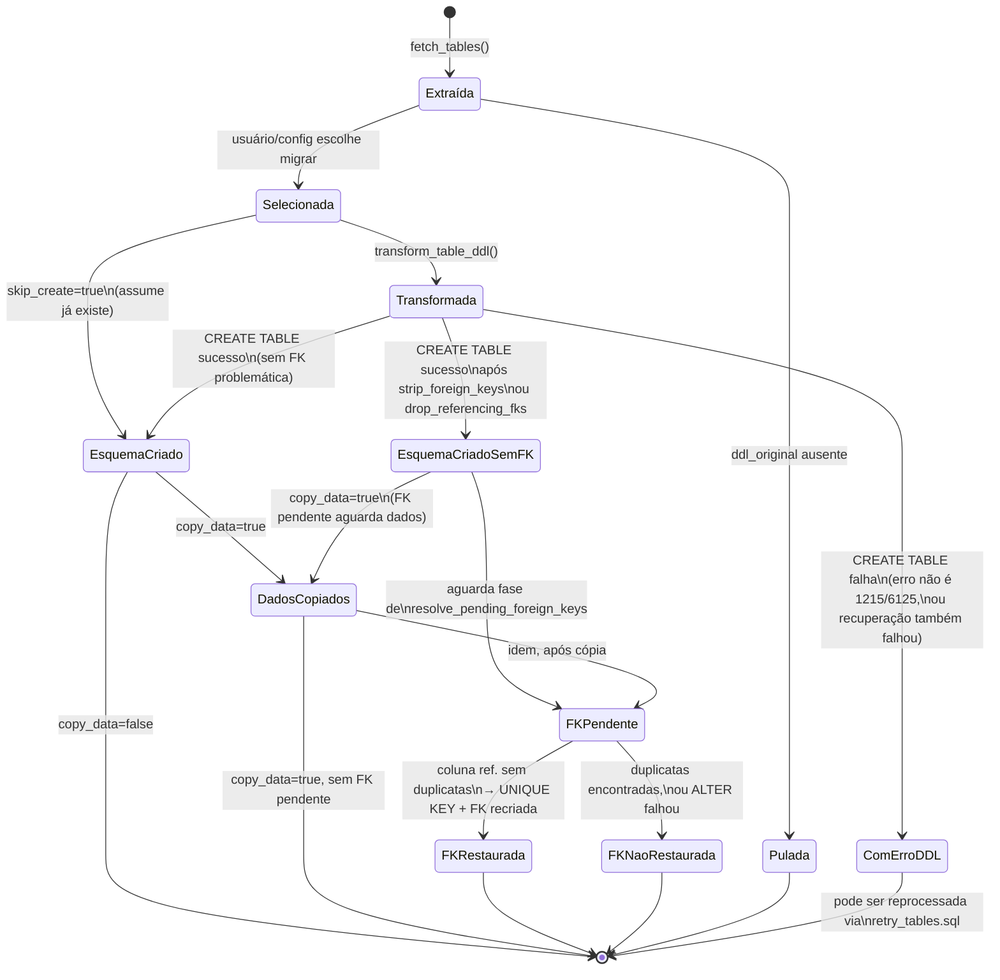

# Máquinas de Estado — migra_db_mysql

> Gerado pelo Detective em 2026-09-02
> Escala de confiança: 🟢 CONFIRMADO · 🟡 INFERIDO · 🔴 LACUNA

Não há uma entidade de domínio persistida com campo de status explícito (não é uma aplicação com "pedidos" ou "usuários" com um campo `status`). O que existe é o **ciclo de vida implícito de um item de migração** (uma rotina ou uma tabela), observável através dos campos booleanos/opcionais dos dicts de resultado (`applied`, `skipped`, `apply_error`, etc. — ver `data-dictionary.md`). Os diagramas abaixo tornam esse ciclo de vida explícito. 🟡 Inferido da lógica de `main()`, não de uma máquina de estado formal no código (não há enum de estado nem transições nomeadas).

## Ciclo de vida — Rotina (procedure/function)

Campos que materializam cada estado no dict de resultado:

| Estado | `applied` | `skipped` | `apply_error` |
|---|---|---|---|
| Pulada | `False` | `True` | mensagem (`"DDL indisponível: ..."`) |
| Aplicada | `True` | `False` | `None` |
| Com erro | `False` | `False` | mensagem do MySQL |

## Ciclo de vida — Tabela

Mais elaborado que o de rotina por causa da recuperação de foreign keys e da cópia de dados opcional.

Campos que materializam cada estado:

| Estado | `applied` | `skipped` | `apply_error` | issues relevantes |
|---|---|---|---|---|
| Pulada | `False` | `True` | `"DDL indisponível: ..."` | — |
| Com erro DDL | `False` | `False` | mensagem do MySQL | pode incluir `FK_REMOVED` se a recuperação chegou a remover FKs antes de falhar de novo |
| Esquema criado (sem FK pendente) | `True` | `False` | `None` | nenhuma issue de FK |
| Esquema criado sem FK | `True` | `False` | `None` | `FK_REMOVED` (warning) — FK entra em `pending_fks` |
| FK restaurada | `True` | `False` | `None` | `FK_RESTORED` (info), adicionado depois do loop principal |
| FK não restaurada | `True` | `False` | `None` | `FK_NOT_RESTORED` (warning) — tabela e dados migrados, mas sem a constraint |

🟡 Nota: uma tabela pode terminar `applied=True` mesmo com uma FK que nunca foi restaurada — "sucesso" na migração de tabelas não implica integridade referencial completa preservada, é um trade-off deliberado (ver `domain.md`, seção "Sobre a estratégia de recuperação de FK").

## Lacunas 🔴

Não há uma transição de estado para "migração parcialmente aplicada e depois revertida" — se `apply_routine`/`apply_table` falha, o rollback é apenas da própria transação SQL (uma rotina ou tabela), não há rollback do lote inteiro nem de rotinas/tabelas já aplicadas anteriormente na mesma execução.
