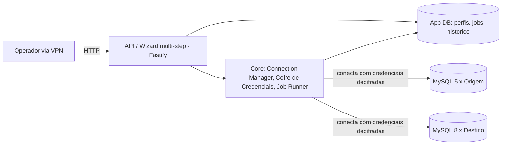

# Segurança e Stack — migra_db_mysql (versão web)

_2026-09-21_

## Resumo

O `migrar_db_mysql` está migrando de um par de scripts CLI Python (`migrate_routines.py`, `fix_collation_stamp.py`) para uma aplicação web Node.js/TypeScript — backend Fastify + frontend Vite —, de uso interno via VPN. A stack é deliberadamente mínima (sem fila/broker externo, sem framework de UI). A segurança apoia-se em dois pilares: o perímetro de rede como controle de acesso (sem login próprio) e um cofre de credenciais cifrado para as senhas dos MySQL de origem/destino migrados.

## Stack técnica

| Camada | Tecnologia | Versão | Observação |
| --- | --- | --- | --- |
| Backend | Node.js | ≥ 20 | `engines.node` em `package.json` |
| Backend | TypeScript | 5.5 | compilado via `tsc`, dev via `tsx watch` |
| Backend (framework HTTP) | Fastify | 5.2 | `src/app.ts` |
| Backend (CORS) | `@fastify/cors` | 11.3 | restringe por `CORS_ORIGIN` (default `http://localhost:5173`) |
| Backend (driver MySQL) | `mysql2` | 3.11 | conecta tanto no App DB quanto nos MySQL de origem/destino |
| Backend (testes) | Vitest | 2.0 | 37 testes automatizados, `npm run test` |
| Frontend | Vite + TypeScript | Vite 5.4 | sem framework de UI — DOM direto, decisão deliberada de stack mínima |
| App DB | MySQL 8.x | — | schema próprio (`src/core/db/migrations/001_init.sql`), separado dos bancos que a ferramenta migra |
| Orquestração de jobs | nenhuma (sem fila/broker) | — | job roda em background no próprio processo Node — decisão AD-01, ver `target_architecture.md` |

Não há Dockerfile nem manifesto de deploy no repositório ainda — hoje a execução é `npm run dev`/`npm run build` + `npm start` diretos.

## Arquitetura e fluxo de dados

A aplicação escuta em `0.0.0.0` (todas as interfaces) na porta `PORT` (default 3000) — o isolamento de rede na VM de produção (firewall/security group) precisa ser configurado pela infraestrutura, a aplicação em si não restringe por IP de origem.

O **App DB** (`connection_profiles`, `migration_jobs`, `job_items`, `job_item_fk_specs`, `job_reports`) é um MySQL 8.x separado dos bancos que a ferramenta efetivamente migra — guarda só estado da própria aplicação (perfis de conexão cifrados, histórico de jobs). A sugestão original da spec (`target_architecture.md` § Notas) é hospedá-lo como schema separado no próprio MySQL 8.x de destino, para não introduzir um motor de banco novo só para isso — decisão em aberto para a infraestrutura confirmar na VM de produção.

Não há fila/broker externo (Redis, Kafka, SQS): o job de migração roda sequencialmente dentro do próprio processo Node, persistindo progresso incrementalmente no App DB a cada item processado.

## Cofre de credenciais

Cada perfil de conexão (origem/destino) grava host, porta, usuário e senha do MySQL sendo migrado no App DB (`connection_profiles`). A senha nunca fica em texto claro:

- **Algoritmo**: AES-256-GCM, via `node:crypto` (`src/core/credentialVault.ts`).
- **Formato armazenado**: `password_enc VARBINARY(512)` = IV (12 bytes) + auth tag (16 bytes) + texto cifrado.
- **Chave**: `CREDENTIAL_VAULT_KEY`, 32 bytes em hex, hoje fornecida **apenas por variável de ambiente local** (`.env`, fora do controle de versão) — não há integração com secret manager/KMS ainda.
- **Superfície da API**: nenhum endpoint retorna a senha em texto claro (nem mascarada) — só `resolveForConnection()`, uso interno do Connection Manager, decifra, e o resultado nunca sai da camada de serviço.
- **Logs**: a senha nunca é logada, mesmo em erro de conexão (confirmado testando falhas de auth reais — o log só mostra usuário/host/erro do MySQL, nunca a senha).
- Sem endpoint de edição de perfil nesta entrega — corrigir um perfil hoje exige excluí-lo e recriá-lo.

## Controle de acesso

- **Sem autenticação/login na aplicação** — decisão confirmada em sessão de esclarecimento (`_reversa_forward/001-frontend-wizard-migracao-web/requirements.md` § Requisitos Não-Funcionais, linha "Segurança"): o controle de acesso assumido é **só o perímetro de rede (VPN, uso interno)**.
- Isso significa que qualquer máquina com rota de rede até a porta `3000` (backend) e `5173`/porta de build do frontend consegue usar a aplicação inteira — criar/excluir perfis de conexão, disparar migrações reais contra qualquer MySQL alcançável. **A VPN/segmentação de rede da VM é o único controle de acesso** — ponto que a infraestrutura precisa validar antes do go-live.
- **CORS**: restrito por `CORS_ORIGIN` (env var do backend, default `http://localhost:5173`) — em produção precisa apontar para o domínio real do frontend, senão o navegador bloqueia as chamadas.
- Nenhuma proteção contra CSRF, rate limiting ou WAF identificada no código atual — coerente com a premissa de "uso interno via VPN", mas vale confirmar se essa premissa segue válida na topologia de rede da VM de produção.

## Riscos de segurança conhecidos

**RISK-005** (`_reversa_sdd/migration/risk_register.md`) — a Área de Infraestrutura já está listada como *owner* deste risco na spec original:

> O cofre de credenciais introduz uma superfície de ataque nova que não existia no legado (onde a senha nunca era persistida, só digitada por sessão de terminal). Um vazamento do banco da aplicação web exporia credenciais de múltiplos bancos MySQL, algo que o legado nunca centralizava.

|  |  |
| --- | --- |
| Probabilidade | Baixa |
| Impacto | Alto |
| Severidade combinada | Média |
| Status | Aberto |

**Mitigações recomendadas pela spec, ainda não implementadas:**

1. Mover `CREDENTIAL_VAULT_KEY` de variável de ambiente local para um secret manager da VM (ex.: Vault, AWS Secrets Manager, ou equivalente interno).
2. Definir um procedimento de rotação de credenciais — hoje não existe, e trocar a `CREDENTIAL_VAULT_KEY` invalida todas as senhas já cifradas no App DB (precisariam ser recadastradas).
3. Garantir que o App DB em si tenha backup/acesso restrito equivalente a um banco que guarda credenciais — mesmo cifradas, um dump do banco + a chave juntos comprometem tudo.

## Checklist para produção

- [ ] Definir onde a VM vai ficar na topologia de rede (segmento VPN) — é o único controle de acesso da aplicação hoje.
- [ ] Mover `CREDENTIAL_VAULT_KEY` para secret manager/KMS da VM, fora de `.env` em disco.
- [ ] Definir procedimento de rotação de credenciais (RISK-005).
- [ ] Configurar `CORS_ORIGIN` para o domínio real do frontend em produção.
- [ ] Decidir hospedagem do App DB: schema separado no MySQL 8.x de destino (sugestão da spec) ou instância dedicada — e aplicar hardening padrão de MySQL (usuário dedicado, sem root, backups).
- [ ] Configurar TLS/reverse proxy na frente do Fastify (hoje a aplicação escuta HTTP puro em `0.0.0.0:3000`).
- [ ] Definir processo de deploy/restart (não há Dockerfile, systemd unit ou CI/CD no repositório ainda — hoje é `npm run build` + `npm start` manual).
- [ ] Confirmar retenção/rotação de logs de aplicação (hoje são só JSON estruturado em stdout, sem destino persistente configurado).
- [ ] Validar que o firewall/security group da VM restringe a porta do backend ao segmento VPN esperado, não expõe publicamente.

## Referências

| Documento | Conteúdo |
| --- | --- |
| `_reversa_sdd/migration/target_architecture.md` | Stack, componentes, diagrama, decisões arquiteturais (AD-01 a AD-03) |
| `_reversa_sdd/migration/risk_register.md` | Registro completo de riscos, incluindo RISK-005 (segurança do cofre de credenciais) |
| `_reversa_sdd/migration/target_data_model.md` | Schema do App DB, incluindo `password_enc` |
| `_reversa_forward/001-frontend-wizard-migracao-web/requirements.md` | Requisitos não-funcionais de segurança (perimetro VPN, sem login) |
| `src/core/credentialVault.ts` | Implementação real da cifragem AES-256-GCM |
| `README.md` (repositório, branch `migracao-web-stack`) | Passo a passo de setup local (App DB, `CREDENTIAL_VAULT_KEY`) |

Todos os caminhos são relativos à raiz do repositório, branch `migracao-web-stack`.
